# Table of Contents

- [**Introduction**](#Introduction)
   - [***Overview of the Ebook***](#overview-of-the-ebook)
   - [***Importance of Cybersecurity in the Digital Age***](#importance-of-cybersecurity-in-the-digital-age)
   - [***Brief Introduction to Whoisfreaks***](#brief-introduction-to-whoisfreaks)

- [**Whoisfreaks Products: An Overview**](#whoisfreaks-products-an-overview)
   - [***Product Categories and Their Functions***](#product-categories-and-their-functions)
   - [***Integration of Whoisfreaks in Cybersecurity Solutions***](#integration-of-whoisfreaks-in-cybersecurity-solutions)

- [**Understanding Domain Dynamics in Cybersecurity**](#understanding-domain-dynamics-in-cybersecurity)
   - [***Role of Newly Registered Domains***](#role-of-newly-registered-domains)
   - [***Role of Expired Domains***](#role-of-expired-domains)

- [**Combatting Sophisticated Cyber Threats with Whoisfreaks**](#combatting-sophisticated-cyber-threats-with-whoisfreaks)
   - [***Whaling Attacks: Identifying and Preventing Email Spoofing***](#whaling-attacks-identifying-and-preventing-email-spoofing)
       - [****Anatomy of a Whaling Attack****](#anatomy-of-a-whaling-attack)
       - [****Real life example of a Whaling Attack****](#real-life-example-of-a-whaling-attack)
       - [****Preventing Whaling Attacks with Whoisfreaks APIs and Data Feeds****](#preventing-whaling-attacks-with-whoisfreaks-apis-and-data-feeds)
   - [***Phishing Attacks: Strategies for Detection and Prevention***](#phishing-attacks-strategies-for-detection-and-prevention)
       - [****Real life examples of Phishing Attack****](#real-life-examples-of-phishing-attack)
       - [****Post Analysis on Phishing Attacks with Whoisfreaks APIs and Data Feeds****](#post-analysis-on-phishing-attacks-with-whoisfreaks-apis-and-data-feeds)
   - [***Domain Theft Attacks: Prevention and Recovery***](#domain-theft-attacks-prevention-and-recovery)
       - [****Understanding Domain Hijacking****](#understanding-domain-hijacking)
       - [****Real life Examples of Domain theft****](#real-life-examples-of-domain-theft)
       - [****Role of Whoisfreaks in Safeguarding Domains****](#role-of-whoisfreaks-in-safeguarding-domains)
   - [***DDoS Post-Incident Analysis***](#ddos-post-incident-analysis)
       - [****Analyzing DDoS Attacks****](#analyzing-ddos-attacks)
       - [****Real life Example of DDoS Attack****](#real-life-example-of-ddos-attack)
       - [****How Whoisfreaks Aids in Post-Attack Analysis****](#how-whoisfreaks-aids-in-post-attack-analysis)
   - [***Zero-Day Exploits Post-Analysis***](#zero-day-exploits-post-analysis)
       - [****Understanding Zero-Day Vulnerabilities****](#understanding-zero-day-vulnerabilities)
       - [****Leveraging Whoisfreaks for Quick Response****](#leveraging-whoisfreaks-for-quick-response)

- [**SSL Certificates: Vulnerabilities and Attacks**](#ssl-certificates-vulnerabilities-and-attacks)
    - [***Man-in-the-Middle (MitM) Attacks***](#man-in-the-middle-mitm-attacks)
    - [***Usage of WhoisFreaks in Analyzing SSL Certificates and Their Complete Chains***](#usage-of-whoisfreaks-in-analyzing-ssl-certificates-and-their-complete-chains)

- [**Monitoring and Protecting Brand Identity**](#monitoring-and-protecting-brand-identity)
   - [***Brand Protection Strategies Using Whoisfreaks***](#brand-protection-strategies-using-whoisfreaks)
       - [****Identifying and Combating Brand Impersonation****](#identifying-and-combating-brand-impersonation)
       - [****Case Studies: Successful Brand Protection Efforts****](#case-studies-successful-brand-protection-efforts)
   - [***Counteracting Typosquatting and Similar Domain Frauds***](#counteracting-typosquatting-and-similar-domain-frauds)
       - [****Identifying Domain Squatters****](#identifying-domain-squatters)
       - [****Strategies for Prevention and Response****](#strategies-for-prevention-and-response)

- **Conclusion**
   - Summarizing Key Insights
   - Future Trends in Cybersecurity and Role of Whoisfreaks
   - Final Thoughts and Recommendations

# Introduction

## Overview of the Ebook

In this ebook, we embark on a journey through the dynamic landscape of cybersecurity, exploring its pivotal role in the digital age. Our primary focus is to understand and leverage the innovative solutions offered by Whoisfreaks, enhancing cybersecurity measures. This includes comprehensive coverage of domain and IP whois information, encompassing newly registered, expired, and dropped domains.

Following this, we delve into the utilization of domain and IP whois information to trace back the sources of attacks. This step provides a practical approach to identifying and mitigating potential threats. Our exploration continues as we dive deep into different types of cybersecurity attacks. The post-analysis involves leveraging Whoisfreaks' [whois]() and DNS databases, offering valuable insights into the nature and origin of these attacks.

Additionally, we explore various monitoring tools tailored for domains, brands, and registrants. These tools collectively form the foundation for robust cybersecurity analysis, enabling a proactive stance against evolving threats. Join us in uncovering the intricacies of cybersecurity, learning to harness the power of Whoisfreaks, and gaining insights that empower effective defense strategies in the ever-evolving digital landscape.

## Importance of Cybersecurity in the Digital Age
The importance of cybersecurity in the digital age cannot be overstated, as our lives, businesses, and critical infrastructure are increasingly intertwined with digital technologies. Here are key reasons highlighting the significance of cybersecurity:
   - In the digital age, vast amounts of sensitive information, including personal, financial, and business data, are stored and transmitted electronically. Cybersecurity measures are essential to safeguard this information from unauthorized access, theft, or manipulation.
   - Cyber attacks can result in significant financial losses for individuals, businesses, and governments. Cybersecurity helps prevent financial fraud, online scams, and other malicious activities that could lead to monetary losses.

In conclusion, cybersecurity is a fundamental aspect of our interconnected, digital world. It is not only about protecting data but also about preserving trust, privacy, and the overall integrity of the digital ecosystem. As technology continues to advance, the importance of robust cybersecurity measures will only grow.

## Brief Introduction to Whoisfreaks
In the ever-evolving landscape of digital security, the need for comprehensive and effective tools has never been more pressing. Enter Whoisfreaks, a cutting-edge platform at the forefront of cybersecurity innovation. Whoisfreaks stands out as a pivotal resource for professionals and enthusiasts alike, offering an extensive suite of services designed to enhance and fortify online security measures.

At its core, Whoisfreaks is renowned for its robust domain and IP information services. These services provide invaluable insights into the ownership, history, and associated metadata of domain names and IP addresses - information that is crucial in the battle against cyber threats. By leveraging the power of Whoisfreaks, users can delve deep into the digital footprint of entities across the internet, equipping themselves with the knowledge needed to identify, analyze, and counteract potential security risks.

As we embark on an exploration of Whoisfreaks and its integral role in cybersecurity, it's essential to recognize the platform's versatility. From aiding in threat intelligence and risk assessment to bolstering brand protection strategies, Whoisfreaks emerges as a multifaceted ally in the pursuit of a safer digital world.

# Whoisfreaks Products: An Overview

## Product Categories and Their Functions
WhoisFreaks offers a comprehensive suite of tools and APIs designed for various domain-related needs, including WHOIS lookups, domain availability checks, and monitoring services. Their products are tailored for cybersecurity professionals, domain investors, and businesses concerned with brand protection and digital security.

- **Domain WHOIS lookup APIs** [🔗](https://whoisfreaks.com/products/whois-api.html)
    - Live WHOIS lookup 
    - Historical WHOIS lookup
    - Reverse WHOIS lookup 
    - Bulk Domain live WHOIS lookup (limit 100 domains each request)
- **IP WHOIS lookup**[🔗](https://whoisfreaks.com/documentation/api/ip-whois-api.html)
- **ASN WHOIS lookup**[🔗](https://whoisfreaks.com/documentation/api/asn-whois-api.html)
- **Domain Availability lookup**[🔗](https://whoisfreaks.com/products/domain-availability-api.html)
- **DNS lookup APIs**[🔗](https://whoisfreaks.com/products/dns-checker-api.html)
    - Live DNS lookup
    - Historical DNS lookup
    - Reverse DNS lookup
- **SSL Certificate lookup** [🔗](https://whoisfreaks.com/products/ssl-certificate-api.html)
- **Data feeds**
    - Newly registered domains (with or without WHOIS and DNS records) [🔗](https://whoisfreaks.com/products/newly-registered-domains.html)
    - Expired and Dropped Domains (with an without WHOIS records) [🔗](https://whoisfreaks.com/products/expiring-dropped-domains.html)
- **Whois Databases**
    - Domains WHOIS databases (full, active, coutry wise, registrar wise, tld wise domains databases) [🔗](https://whoisfreaks.com/products/whois-database.html)
    - IP WHOIS database [🔗](https://whoisfreaks.com/products/whois-database.html)
    - ASN WHOIS database [🔗](https://whoisfreaks.com/products/whois-database.html)
    - DNS databases [🔗](https://whoisfreaks.com/pricing/dns-database.html)
- **Monitoring tools**
    - Domain Monitoring [🔗](https://whoisfreaks.com/products/domain-monitoring.html)
    - Brand Monitoring [🔗](https://whoisfreaks.com/products/brand-monitoring.html)
- **Utility tools**
    - Bulk Domain Lookup(limit 3 million domains) [🔗](https://whoisfreaks.com/products/bulk-whois-lookup.html)

## Integration of Whoisfreaks in Cybersecurity Solutions
Before we deep dive into technical integrations, we will first try to understand simpler use cases.

### Getting real-time domain data
Here, we'll explore [live whois lookup tool](https://whoisfreaks.com/tools/whois/lookup) necessary for obtaining up-to-date information on domain registrations, status, and ownership details.

[Try Whoisfreaks tool.](https://whoisfreaks.com/tools/whois/lookup/whoisfreaks.com)

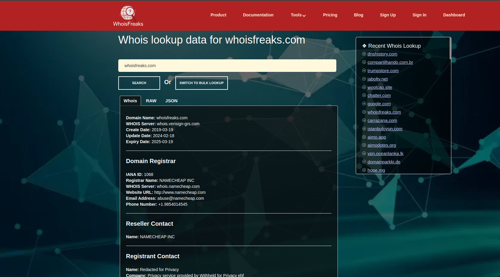

Just go to the live tool, enter your required domain, and unlock the visibility of registrar, registrant, technical, admin contacts, and much more information to perform a deeper analysis.

Curious about analyzing a large number of domains? Will this take a lot of time? Welcome to WhoisFreaks! We also offer bulk live lookup, where you can enter more than one domain.

[Try bulk WHOIS lookup tools.](https://whoisfreaks.com/tools/whois/bulk/lookup)

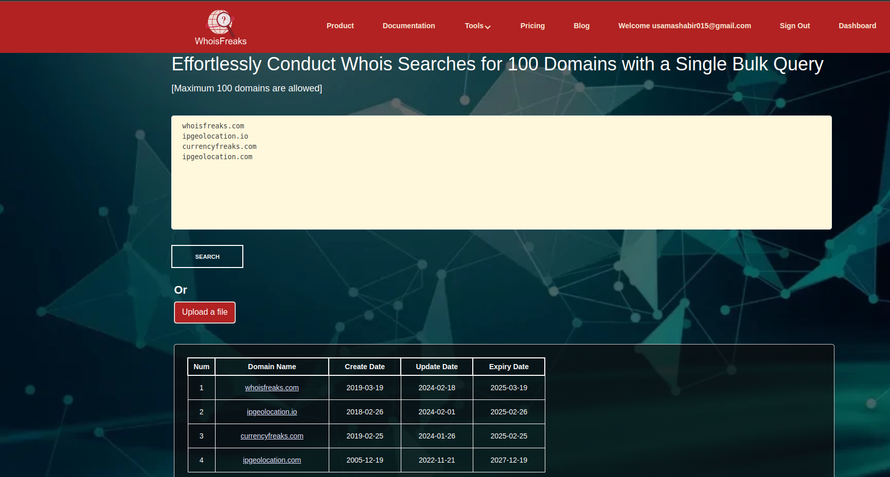

If you want to query more than 100 domains, you can also upload a file. 

### Getting past domain ownership information
Want to know who owned a specific domain in the past and who is currently acquiring it? You can use our [historical WHOIS lookup tool](https://whoisfreaks.com/tools/user/whois/history/lookup) to obtain past information about a domain.

Using the WHOIS historical tool, you can not only find the past and current owner, but you can also correlate domains with similar information, monitor illegal usage of your domain, and investigate domain ownership problems.

[Try historical WHOIS lookup tools.](https://whoisfreaks.com/tools/user/whois/history/lookup/whoisfreaks.com)

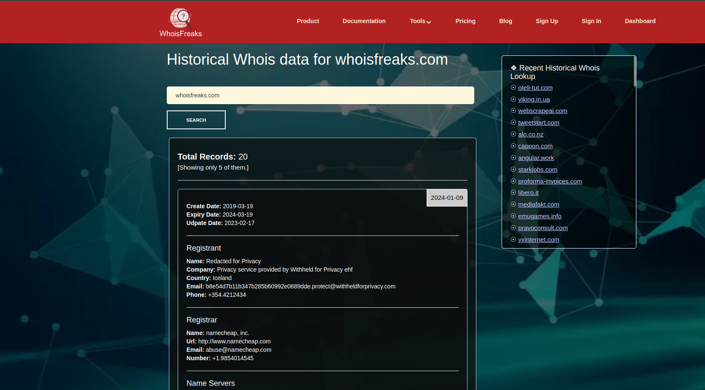

### Looking for domains that contains a specific keyword
Want to identify domains that are associated with WHOIS and DNS records availability or those linked to a specific brand? Utilize our advanced [Reverse WHOIS Lookup tool](https://whoisfreaks.com/tools/user/whois/reverse/search), which employs strategic keyword analysis, to unveil a comprehensive list of domains based on required brand's keyword. This tool not only reveals the quantity of such domains but also provides you with their specific names, enabling you to navigate the intricate web of domain-related intelligence with precision and ease.

[Try keyword Reverse WHOIS lookup tools.](https://whoisfreaks.com/tools/user/whois/reverse/search/keyword/whois?page=1)

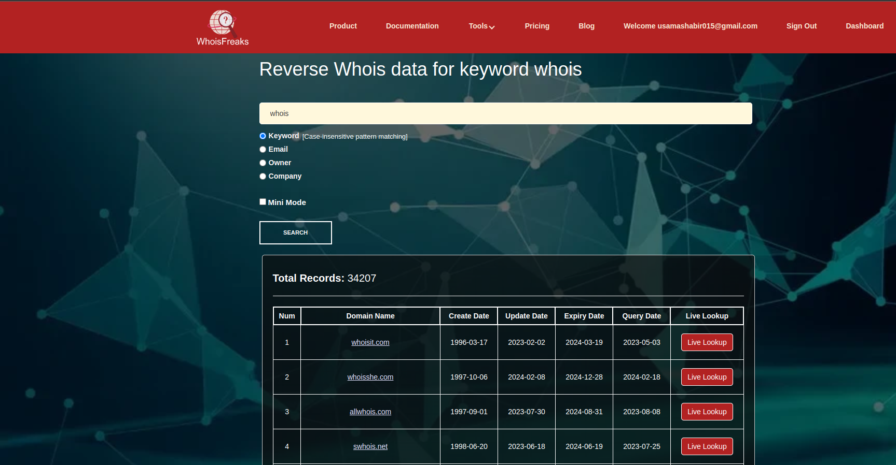

### Searching for domains owned by a specific person
To uncover the list of domains associated with an individual, leverage the capabilities of our sophisticated Reverse WHOIS Lookup tool. This innovative tool utilizes a detailed analysis of the owner's name, offering a strategic approach to identifying domains linked to a specific person.

[Try owner Reverse WHOIS lookup tools.](https://whoisfreaks.com/tools/user/whois/reverse/search/owner/ejaz%20ahmed?page=1)

### Searching for domains owned using a specific email
For a targeted exploration of domain connections via email addresses, our advanced Reverse WHOIS Lookup tool stands ready. This precise instrument sifts through email-associated domains, furnishing a comprehensive list of domains linked to a given email. Ideal for cybersecurity assessments, intellectual property management, and digital footprint analysis, this tool streamlines the discovery process, enhancing investigative efficiency and insight depth.

[Try email Reverse WHOIS lookup tools.](https://whoisfreaks.com/tools/user/whois/reverse/search/email/ejaz_ahmed@outlook.com?page=1)

### Searching for domains owned by an organization.
To strategically identify domains registered under a specific corporate entity, our Reverse WHOIS Lookup tool, enhanced for company name analysis, proves indispensable. This pivotal resource empowers cybersecurity professionals to map out a corporation's digital terrain comprehensively. By revealing the network of domains tied to a company;
- It aids in the proactive defense against digital threats.
- It facilitates the tracking of potential trademark infringements, and supports thorough risk assessment processes. 

This tool elevates cybersecurity efforts by providing an extensive view of a company’s online presence, enabling more informed protective strategies.

[Try email Reverse WHOIS lookup tools.](https://whoisfreaks.com/tools/user/whois/reverse/search/company/jfreaks?page=1)

### Searching for domains pointing to same IP address
[Reverse DNS lookup](https://whoisfreaks.com/tools/dns/reverse/lookup) technique for A records is crucial in identifying all domains pointing to the same IP address. This capability is essential for various cybersecurity tasks, such as expanding the attack surface during server reconnaissance, identifying vulnerabilities, and enhancing security measures. By performing a reverse IP lookup, cybersecurity professionals can pinpoint virtual hosts on a web server, revealing potential entry points for security breaches.

The importance of reverse DNS lookups in cybersecurity cannot be overstated. It aids in filtering spam by verifying if the IP address of an incoming mail server matches the domain it claims to represent, thus adding an additional layer of email security.

Reverse DNS lookups also play a pivotal role in incident response and threat intelligence. Identifying hostnames associated with an attacking system can unveil other domains related to the attacker, offering insights that might be critical in mitigating cyber attacks.

[Try Reverse DNS lookup tools.](https://whoisfreaks.com/tools/dns/reverse/lookup/a/12.34.54.23)

## Understanding Domain Dynamics in Cybersecurity

### Role of Newly Registered Domains

#### Identifying Potential Threats
Newly registered domains (NRDs) play a crucial role in cybersecurity due to their potential use in various malicious activities. These domains are often registered and used by cybercriminals shortly after their creation for;
- Phishing attacks.
- Malware distribution.
- Command and Control (C2) servers.
- Credential stuffing.
- Domain squatting, typosquatting.

#### Prevention Strategies
To prevent attacks using WhoisFreaks' Newly Registered Domains, you can access our API to download Whois files in CSV format or query domains in JSON format. This allows for monitoring of newly registered domains for specific dates across gTLDs and ccTLDs. Utilizing this data, you can implement security measures to block or scrutinize access to these domains, which are often used maliciously. For detailed information on how to use the API, including code snippets for various programming languages, visit NRDs [documentation](https://whoisfreaks.com/documentation/domains/newly-registered-domains.html).​

### Role of Expired Domains

#### Identifying Potential Threats

Expired domains can lead to vulnerabilities such as 
- Phishing attacks, where criminals create fake sites to steal information. 
- Malware distribution, using domains to spread harmful software.
- Business Email Compromise (BEC), impersonating legitimate business communications for fraudulent purposes​.

#### Prevention Strategies

To mitigate the threats posed by expired domains, organizations should implement a comprehensive domain management strategy. This includes;
- Regularly auditing and tracking domain registrations to ensure key domains are renewed on time.
- Employing domain monitoring services to keep an eye on the status of all company domains, and using security tools to detect and block malicious activities associated with expired domains. One such tool called [Domain Monitoring](https://whoisfreaks.com/products/domain-monitoring.html) is created to avoid such situations.

## Combatting Sophisticated Cyber Threats with Whoisfreaks

### Whaling Attacks: Identifying and Preventing Email Spoofing

#### Anatomy of a Whaling Attack

A whaling attack is a type of phishing scam that targets high-profile individuals within an organization, such as C-level executives, managers, or other key personnel. The term "whaling" is derived from the size of the targets, implying that these individuals are the "big fish" of the organization. These attacks are highly personalized and often involve extensive research on the target to make the scam as convincing as possible. The goal is to deceive the victim into disclosing sensitive information, transferring funds, or granting access to restricted systems or data. The anatomy of a whaling attack typically involves several key phases, each meticulously designed to deceive the target and achieve the attacker's objectives. Here's a brief overview;

- **Target Identification:** The attacker chooses a high-profile individual within an organization, such as a CEO, CFO, or another executive.
- **Research and Reconnaissance:** The attacker conducts extensive research on the target to gather personal and professional information. 
- **Spoofing or Domain Masquerading:** The attacker may create a fake email account or website that closely resembles a legitimate one
- **Data Exfiltration or Financial Gain:** Once the attacker has obtained what they were seeking, whether it's confidential information, financial assets, or access credentials, they proceed to exploit this for financial gain, espionage, or further attacks.

#### Real life example of a Whaling Attack

One notable example of a whaling attack occurred in 2016, when the CEO of FACC, an Austrian aerospace manufacturer, fell victim to a scam that resulted in the company losing 50 million euros. The attackers impersonated the CEO in an email, instructing an employee to transfer the funds for what was claimed to be an "acquisition project". Due to the high level of trust in communications appearing to be from the CEO, the employee complied, resulting in a substantial financial loss for the company.

#### Preventing Whaling Attacks with Whoisfreaks APIs and Data Feeds

WHOISfreaks offers a range of APIs and data feeds that can be leveraged to prevent whaling attacks by providing detailed information about domains and the entities behind them. Here’s how you can use these tools to enhance your organization’s cybersecurity posture:

The reference domain considered in the explanation below is [`whoisfreaks.com`](https://whoisfreaks.com/tools/whois/lookup/whoisfreaks.com).
- **Domain Verification:** Use the whoisfreaks API to verify the authenticity of the domain names associated with incoming emails. By checking the domain registration details, you can identify suspicious or recently registered domains that might be used for phishing attacks.

    In the given scenario, when receiving an email from either [`whoisfriends.com`](https://whoisfreaks.com/tools/whois/lookup/whoisfriends.com) or [`whoisfake.com`](https://whoisfreaks.com/tools/whois/lookup/whoisfake.com), the initial procedure involves utilizing the whoisfreaks live lookup API. This step includes comparing the registrant information of the incoming email's domain with the original reference domain, 'whoisfreaks.com.' If both domains match, the verification process proceeds to confirm that the domain is not present in the newly registered domains feed. If the incoming mail successfully passes these checks, it is considered acceptable. However, if it fails to meet these criteria, further analysis is initiated by proceeding with the subsequent steps.

- **Registrant Background Checks:** Conduct background checks on the domain registrants using Reverse API. This helps in identifying domains registered by known malicious actors or entities with no legitimate business association with your organization.

    In this particular case, assuming the incoming email's domain belongs to 'xyz.com' as indicated in the live lookup registrant information, the next step involves conducting a reverse query on [`xyz@whoisfake.com`](xyz@whoisfake.com). This process entails identifying the domains associated with the above email. Following that, a thorough examination is carried out to determine if any of the registered domains are linked to malicious activities. If any such association is identified, it raises a red flag for that specific domain. This additional layer of analysis aims to enhance the scrutiny of potentially suspicious domains and strengthen the overall security assessment.

    For a more comprehensive analysis, additional tools such as reverse company search and reverse owner name search can be employed.

- **Automated Alerts:** Implement automated alerts through the whoisfreaks [Brand monitoring tool](https://whoisfreaks.com/products/brand-monitoring.html) to promptly inform your security team of recently registered domains resembling your brand. Thoroughly analyze these domains and any WHOIS record alterations, as they may signify preparations for a whaling attack against your organization.

- **Setting SPF Record:** To prevent your own domain from being used in spoofing attacks, correctly setting up SPF (Sender Policy Framework) records is a crucial step. SPF is an email authentication method designed to detect forging sender addresses during the delivery of the email. By creating an SPF record for your domain, you tell the world which mail servers are authorized to send email on behalf of your domain.

Implementing these preventative measures can significantly reduce the risk of falling victim to a whaling attack. By combining WHOISfreaks' comprehensive domain data with a proactive cybersecurity strategy, organizations can safeguard their executives and sensitive information from sophisticated phishing schemes.

### Phishing Attacks: Strategies for Detection and Prevention

Phishing attacks are fraudulent attempts to obtain sensitive information such as usernames, passwords, and credit card details by disguising oneself as a trustworthy entity in an electronic communication. Typically, these attacks are carried out through email phishing, instant messaging, and text messaging, using deceptive emails or messages that appear to be from reputable companies or individuals. The attacker's goal is to trick the recipient into clicking a malicious link, which can lead to the installation of malware, the freezing of the system as part of a ransomware attack, or the revelation of sensitive information.

#### Real life examples of Phishing Attack

- **Facebook and Google Phishing Scam:** In a notable phishing scam from a few years ago, a Lithuanian hacker tricked employees of Facebook and Google into wiring over $100 million into bank accounts that he controlled. He did this by masquerading as a popular Asian hardware vendor and sending phony invoices to the companies.

- **2020 Twitter Bitcoin Scam:** In July 2020, hackers conducted a massive phishing attack on Twitter, targeting high-profile accounts, including those of Joe Biden, Elon Musk, and Bill Gates, to promote a Bitcoin scam. The attackers gained access to Twitter's internal systems by spear phishing employees for their credentials.

#### Post Analysis on  Phishing Attacks with Whoisfreaks APIs and Data Feeds

Post-analysis in the cybersecurity field, especially concerning phishing attacks, plays a crucial role in understanding the threat landscape, improving security measures, and preventing future incidents.

Analyzing the domain `https://qudscouncil.com/cd/AP/Signin` for potential phishing activities aimed at acquiring user credentials from the Apple Store. Our investigation will utilize the databases provided by WhoisFreaks for a comprehensive examination.

- Initially, conduct a [historical whois lookup on the domain](https://whoisfreaks.com/tools/user/whois/history/lookup/qudscouncil.com), and subsequently, extract pertinent information such as registrant emails and registrant name or company name. The obtained details are depicted in the accompanying images.

    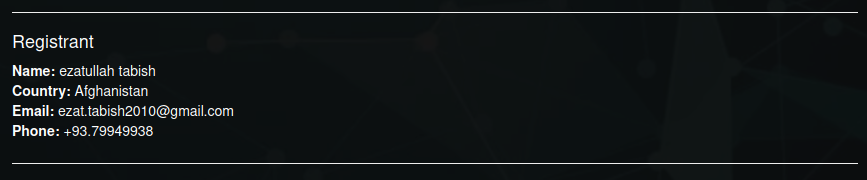

    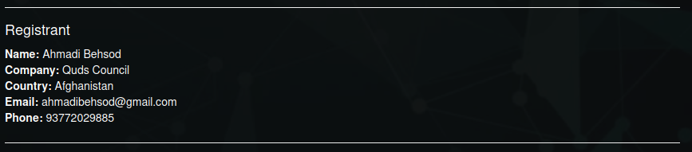

- Next, employ a reverse whois API for email searches on [`ezat.tabish2010@gmail.com`](https://whoisfreaks.com/tools/user/whois/reverse/search/email/ezat.tabish2010@gmail.com?page=1) and [`ahmadibehsod@gmail.com`](https://whoisfreaks.com/tools/user/whois/reverse/search/email/ahmadibehsod@gmail.com?page=1). These inquiries unveil an additional 41 domains associated with the provided email addresses.

- Conduct a live lookup on the aforementioned 41 domains, distinguishing between those that are currently registered and those that are not. The results indicate that only 6 out of the 41 domains are currently registered.The six registered domains identified are as follows: [`jaghorizeba.com`](https://whoisfreaks.com/tools/user/whois/lookup/jaghorizeba.com), [`orps.af`,](https://whoisfreaks.com/tools/user/whois/lookup/orps.af) [`aburayhan.net`](https://whoisfreaks.com/tools/user/whois/lookup/aburayhan.net), [`aburayhan.org`](https://whoisfreaks.com/tools/user/whois/lookup/aburayhan.org), [`kabulweb.com`](https://whoisfreaks.com/tools/user/whois/lookup/kabulweb.com), and [`qudscouncil.com`](https://whoisfreaks.com/tools/user/whois/lookup/qudscouncil.com).

- Following the outlined steps, analyze each of the 6 additional domains individually using the historical whois lookup and reverse whois API with email search. Subsequently, compile a list of domains that demonstrate a connection to the original phishing domain. Upon conducting historical searches, additional email addresses have been uncovered.

    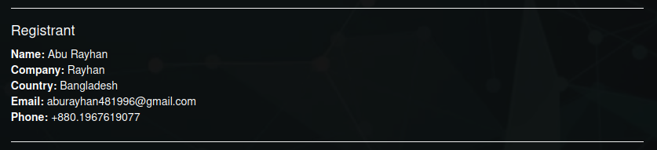

    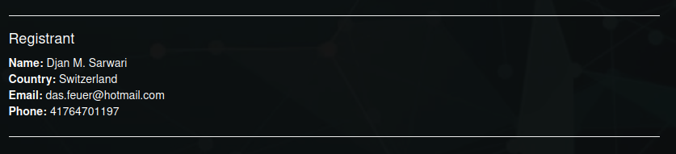

- Next, employ a reverse whois API for email searches on [`aburayhan481996@gmail.com`](https://whoisfreaks.com/tools/user/whois/reverse/search/email/aburayhan481996@gmail.com?page=1) and [`das.feuer@hotmail.com`](https://whoisfreaks.com/tools/user/whois/reverse/search/email/das.feuer@hotmail.com?page=1). These inquiries unveil an additional domain ([freelancerrayhan.com](https://whoisfreaks.com/tools/user/whois/lookup/freelancerrayhan.com)) associated with the provided email addresses.

- Then perform a thorough examination of the websites associated with the identified domains. Focus on reviewing the website content, structure, and any suspicious elements that may indicate phishing activity. Through our investigation, we have uncovered three additional domains associated with phishing activities:

    - The sign-in page on [kabulweb.com](https://kabulweb.com/wp-login.php?redirect_to=https%3A%2F%2Fkabulweb.com%2Fwp-admin%2F&reauth=1) is utilized for phishing WordPress accounts.

For a more in-depth analysis, consider replicating the entire procedure using a reverse API with registrant name search. This approach can provide additional insights and enhance the overall understanding of the situation. 

### Domain Theft Attacks: Prevention and Recovery

#### Understanding Domain Hijacking
A domain theft attack, also referred to as domain hijacking, occurs when an unauthorized party gains access to an organization's domain registration account. In this malicious act, the attacker alters the registration details, essentially transferring ownership of the domain to themselves. Another scenario involves exploiting situations where a domain expires and is not renewed by the organization. The consequences of a domain theft attack can be severe, disrupting online operations, causing financial losses, and tarnishing the reputation of the affected brand.

Domain theft can occur through various methods, including:
    
- **Phishing Attacks:** Attackers might use phishing emails to trick domain owners into revealing their login credentials for their domain registrar's control panel.
- **Expired Domain Exploitation:** Unrenewed domains become susceptible to exploitation, as attackers may register these recently expired domains for the purpose of conducting email spoofing. This poses a significant threat to the security and trustworthiness of email communications.

#### Real life Examples of Domain theft
In 2015, an ex-Google employee, Sanmay Ved, discovered that Google.com was available for purchase on Google's own domain sales service. Ved was able to successfully purchase Google.com for a brief moment for the sum of $12. Ved received confirmation emails with information pertaining to the domain, effectively giving him control over Google.com, albeit very briefly. Google quickly realized the mistake and cancelled the sale, refunding Ved's $12. Google later compensated Ved for the discovery of this flaw, and upon learning that Ved intended to donate his reward to charity, Google doubled the amount.

A notable case of domain theft occurred with the domain 'Pear.com'. This valuable domain was stolen from its rightful owner through unauthorized access to the owner's email or registrar account. The attackers likely used phishing or social engineering tactics to gain the necessary credentials to transfer the domain to another registrar, effectively taking control of it. The original owner faced significant challenges in recovering the domain, involving legal proceedings and negotiations.

Both examples highlight the need for robust cybersecurity measures.

#### Role of Whoisfreaks in Safeguarding Domains

Preventing domain theft requires a multi-faceted approach that includes using tools like WhoisFreaks to monitor and protect domain registration information. Here's how WhoisFreaks can help:

- **Monitor Domain Registration Details:** Regularly use the WhoisFreaks API to monitor your domain's registration details. This can help you quickly detect unauthorized changes to your domain's WHOIS information, such as changes in the registrant’s email, name, or address.

- **Set Up Alerts for Domain Expiry:** Use [WhoisFreaks Domain Monitoring](https://whoisfreaks.com/products/domain-monitoring.html) to set up alerts for your domain's expiry date. Renewing your domain registration well in advance can prevent domain sniping, where attackers register your domain if it accidentally expires.

By incorporating WhoisFreaks into your cybersecurity strategy, you can take a proactive stance in monitoring and protecting your domain's registration details, reducing the risk of domain theft. Additionally, educating your team about the importance of cybersecurity hygiene, such as recognizing phishing attempts and securing login credentials, is crucial in preventing domain theft attacks.

### DDoS Post-Incident Analysis

#### Analyzing DDoS Attacks
Distributed Denial of Service (DDoS) attacks are malicious attempts to disrupt the normal traffic of a targeted server, service, or network by overwhelming the target or its surrounding infrastructure with a flood of Internet traffic. DDoS attacks achieve effectiveness by utilizing multiple compromised computer systems as sources of attack traffic. These systems can include computers and other networked resources such as IoT devices.

DDoS attacks typically occur in the following manner:

- **Compromise:** Attackers build a network of infected computers, known as a botnet, by spreading malicious software through emails, websites, and social media.

- **Command and Control:** Once a botnet has been established, the attacker can remotely control the network of compromised devices.

- **Attack Launch:** The attacker directs the botnet to send requests to the IP address of the targeted server or network. This overwhelms the target's ability to respond, leading to service degradation or complete outage.

#### Real life Example of DDoS Attack

The 2016 Dyn Cyberattack: One of the most notable DDoS attacks occurred on October 21, 2016, targeting Dyn, a major DNS provider. This sophisticated attack involved tens of millions of IP addresses from IoT devices infected with the Mirai botnet. The attackers used these compromised devices to generate an enormous amount of traffic, overwhelming Dyn's infrastructure. Major websites and services, including Twitter, Netflix, PayPal, and Spotify, experienced significant downtime as Dyn struggled to mitigate the attack. This incident highlighted the vulnerabilities associated with IoT devices and the potential scale of DDoS attacks.

#### How Whoisfreaks Aids in Post-Attack Analysis
In the realm of cybersecurity, understanding the anatomy of Distributed Denial of Service (DDoS) attacks and the methodologies for identifying and mitigating such threats is paramount. This theoretical framework provides a comprehensive approach to handling DDoS attacks, focusing on the initial detection of suspicious IP addresses, geographical analysis, domain association, and scrutinizing domain registrant activities for signs of malfeasance.

- **Identification of Suspicious IPs**: The first line of defense against a DDoS attack involves the detection and identification of suspicious IP addresses. This step requires monitoring network traffic to pinpoint anomalies that suggest a coordinated attack. Anomalies may include an unusual influx of requests from specific IP addresses or patterns that deviate significantly from normal traffic.

- **Geographical Analysis**: Once suspicious IPs are identified, the next step entails analyzing the geographical origins of these IPs. This is achieved through services like [ipgeolocation.io](https://ipgeolocation.io/), which provides detailed location data for IP addresses. Geographical analysis can help in understanding the distributed nature of the attack and may assist in identifying the source if certain regions are overrepresented.

- **Detailed IP WHOIS Analaysis**: [IPWhois lookups](https://whoisfreaks.com/tools/ip-whois/lookup/) offers detailed information about the IP addresses, including the organization that registered them, contact information, and the registration dates. This analysis helps in pinpointing the potential source of the attack and understanding the attackers' geographic distribution.
    
    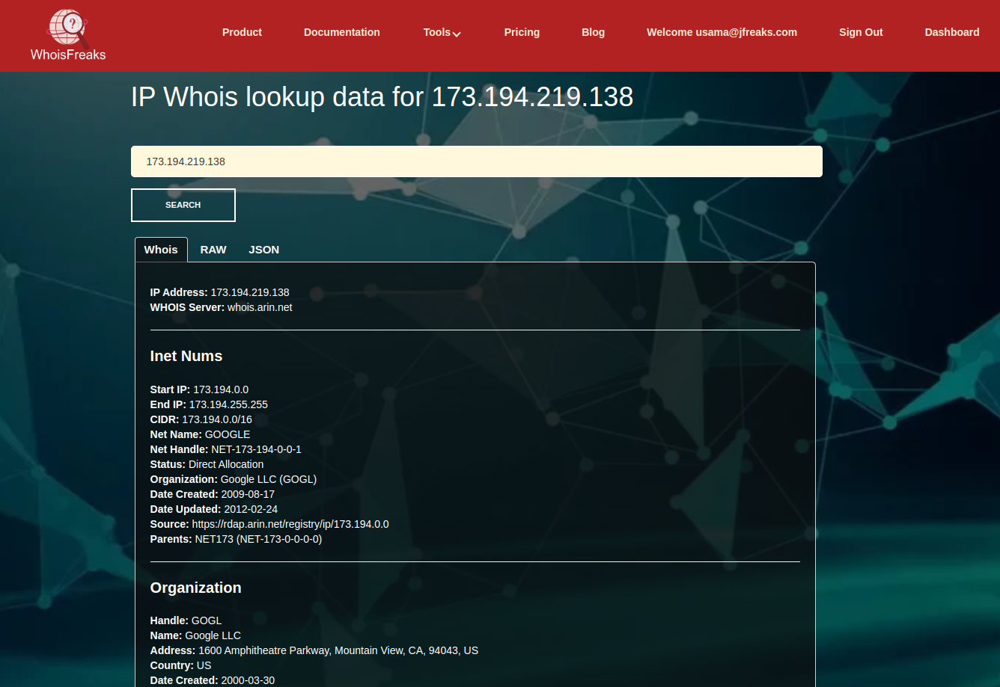

- **Reverse DNS Query for Domain Association**: 
 Once the IPs are identified and their geographical positions are determined, a reverse analysis can be conducted using the [WhoisFreaks Reverse DNS API](https://whoisfreaks.com/tools/dns/reverse/lookup) with A and AAAA records. By providing the IP addresses, this approach enables the retrieval of all domains that were or are currently pointing to those specific IPs.

    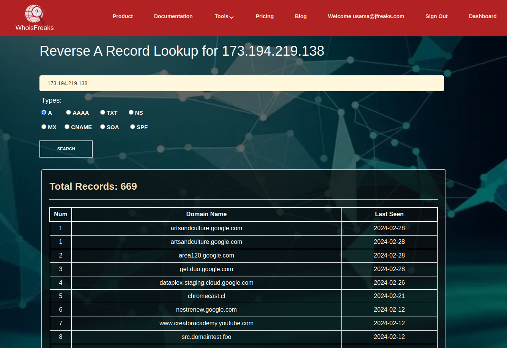

 - **Analysis of Domain Registration Details**: Once all the domains are gathered then deep diving into the individual [domain registration details](https://whoisfreaks.com/tools/whois/lookup) of associated domains reveals crucial information about the entities behind the attack. Analyzing these details for red flags in registrant information can uncover patterns indicative of malicious intent. These red flags includes;
    
    - Anonymous or Privacy Services
    - Fake or Incomplete Registrant Details
    - Frequent Changes in Registrant Information
    - Domains registered to known bad actors, particularly those associated with phishing emails, is crucial for cybersecurity. As discussed in the phishing section.
    - Short-term Registrations
    - Registrant Uses Free or Disposable Email Addresses
    - Geographical Inconsistencies between geographical location of the registrant and the hosting service.

Identifying these patterns requires a nuanced approach, as not all domains exhibiting one or more of these characteristics will be malicious. However, when combined with other indicators or suspicious activities, these patterns can significantly aid cybersecurity analysts in identifying and mitigating potential threats.

### Zero-Day Exploits Post-Analysis

Zero-day exploits represent one of the most challenging cybersecurity threats that organizations face today. Understanding their nature, how they occur, and the strategies for mitigating their impact, including the role of tools like WhoisFreaks in post-analysis, is essential for maintaining cybersecurity resilience.

#### Understanding Zero-Day Vulnerabilities

A zero-day exploit takes advantage of a software vulnerability that is unknown to the software vendor or the public. The term "zero-day" refers to the number of days the software vendor has been aware of the problem, meaning there has been zero time to fix it. These vulnerabilities can exist in operating systems, browsers, applications, or any software component. Exploits that target these vulnerabilities provide attackers with unauthorized access or control, allowing them to steal data, install malware, or perform other malicious activities until the vulnerability is patched.

#### Leveraging Whoisfreaks for Quick Response

Following the discovery and resolution of a zero-day exploit, a comprehensive post-analysis is vital to comprehend the attack's extent, implement preventive measures, and mitigate any incurred damage. Leveraging tools like WhoisFreaks, as detailed in the phishing and DDoS attacks sections, can significantly contribute to this post-analysis phase, providing valuable insights for enhanced cybersecurity.

## SSL Certificates: Vulnerabilities and Attacks

Mishandling of SSL/TLS certificates can lead to various security vulnerabilities and attacks, with one of the most notable being Man-in-the-Middle (MitM) attacks. Such vulnerabilities arise when SSL/TLS certificates are improperly issued, configured, or validated. Here’s an overview of how mishandling of SSL certificates can facilitate attacks, and how WhoisFreaks can aid in analyzing SSL certificates and their complete chains to mitigate these risks.

### Man-in-the-Middle (MitM) Attacks

In a MitM attack, an attacker intercepts the communication between two parties, usually a user and a server, without their knowledge. The attacker can eavesdrop on, modify, or inject new data into the communication. SSL/TLS certificates are crucial for securing web communications and ensuring the integrity and confidentiality of the data exchanged. However, if an SSL certificate is not properly validated by a client (for example, due to lax security configurations in a web browser or an application), an attacker can present a forged or improperly issued certificate, leading the client to believe it is communicating securely with the intended server. This scenario can occur if:

- Certificates are not properly checked against a list of trusted Certificate Authorities (CAs).
- The certificate has been issued to a malicious site by compromising a CA or through lax issuance policies.
- The certificate chain is not properly validated, including checking for revocations or expired certificates.

### Usage of WhoisFreaks in Analyzing SSL Certificates and Their Complete Chains

WhoisFreaks can be instrumental in the analysis and validation of SSL certificates and their chains for security professionals. Although primarily known for WHOIS data and domain intelligence, the principles of using a comprehensive data analysis tool like WhoisFreaks extend to scrutinizing SSL certificate details for anomalies. Here’s how:

- **Verification of Certificate Issuance:** Analysts can use WhoisFreaks to verify the domain details and match them with the SSL certificate issuer information. This can help in identifying discrepancies or forged certificates.

    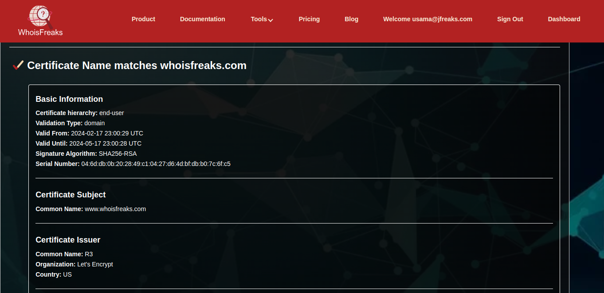

- **Analysis of Certificate Expiry and Validity:** Regular monitoring of SSL certificates for critical domains can prevent the use of expired or soon-to-expire certificates, reducing the risk of security oversights.

    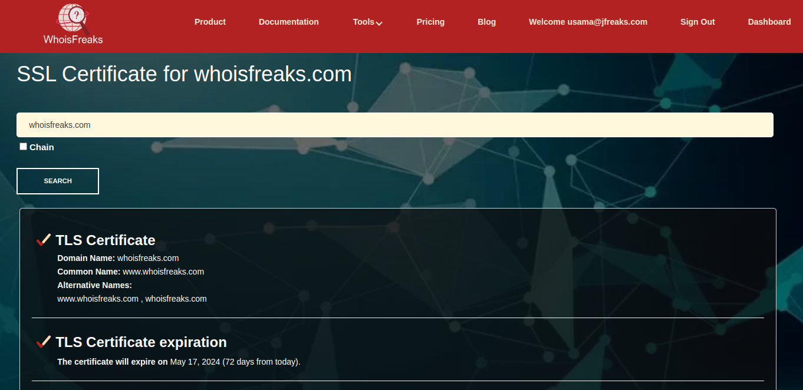

- **Identification of Anomalous Certificate Chains:** By examining the complete certificate chain, security professionals can detect any unusual intermediaries or root certificates that should not be there, indicating a potential compromise or misconfiguration.

- **Cross-referencing Domain Registrations and Certificate Details:** Cross-referencing the details found in SSL certificates with WHOIS data for the associated domains can help in identifying mismatches or fraudulent practices, such as certificates issued to suspicious entities or domains registered with the intent of phishing.

## Monitoring and Protecting Brand Identity

In today's digital landscape, a brand's online presence is as crucial as its physical one. Monitoring and protecting brand identity involves ensuring that a brand's reputation, trademarks, and online assets are not misused or exploited. This includes safeguarding against unauthorized use of the brand name, logos, and domain names that could deceive customers, tarnish the brand's reputation, or result in financial losses.

### Brand Protection Strategies Using Whoisfreaks

WhoisFreaks offers a suite of tools that can be instrumental in brand protection strategies. By leveraging its comprehensive WHOIS database, companies can monitor domain registrations closely to identify any unauthorized use of their brand. This enables them to:

- Detect newly registered domains that mimic their brand name or trademarks, potentially indicating attempts at impersonation or typosquatting.
- Detect domain names similar to your brand name, utilize the WhoisFreaks Reverse API with a keyword search.
- Analyze registration details of suspicious domains, including registrant information, to assess the threat and take appropriate action.
- Indeed, automating the comprehensive analysis described above can be efficiently achieved by subscribing to the Brand Monitor suite of WhoisFreaks. This service offers real-time monitoring, promptly notifying you via email in the event of any suspicious domain registrations, updates, or deletions.

### Counteracting Typosquatting and Similar Domain Frauds

Typosquatting, where attackers register domains similar to a legitimate brand's domain but with typographical errors, is a common fraud tactic. WhoisFreaks helps in counteracting this by enabling brands to monitor for domain registrations that are visually or phonetically similar to their trademarks. Once identified, these domains can be contested through legal channels or domain dispute resolution policies.

#### Identifying Domain Squatters

Domain squatters register domains that include trademarks or brand names with the intention of selling them back to the brand at inflated prices. WhoisFreaks' WHOIS search capabilities enable brands to identify such squatters early on by spotting unauthorized registrations of their trademarks as domain names.

#### Strategies for Prevention and Response

WhoisFreaks offers a comprehensive suite of tools designed for brand protection, including advanced features for detecting typosquatting attempts.

- WhoisFreaks' platform includes functionality to automatically detect and monitor domains that are typographical variations of a brand's domain. This proactive detection helps in identifying potential typosquatting domains as soon as they are registered, which is critical for early intervention.

- Beyond just detecting typos, WhoisFreaks provides detailed observations and analyses of the registered domains. This includes registrant information, domain registration dates, and other WHOIS data that can offer insights into the intentions behind the typosquatting attempts. By analyzing patterns, brands can identify whether a domain was registered maliciously or coincidentally.

- One of the key features of WhoisFreaks in the context of brand protection is its quick notification system. Whenever a potentially malicious typo or similar domain is detected, WhoisFreaks alerts the brand immediately.

By leveraging WhoisFreaks for brand protection and typosquatting detection, brands can significantly enhance their cybersecurity posture and protect their reputation from being exploited by malicious actors. 

## Leveraging DNS Records: Technologies and Scenarios for Effective Digital Management

DNS (Domain Name System) records are crucial elements that help in mapping various aspects of domain name services and related technologies. They play pivotal roles in directing traffic on the internet, specifying domain ownership details, and configuring domain-based email services, among other functions. Here's a detailed mapping of key DNS records and their associations with related technologies.

### A Record

The DNS A (Address) record serves the purpose of mapping a domain name to an IPv4 address. This technology is primarily associated with web hosting and plays a crucial role in identifying servers for HTTP/HTTPS services. The A record acts as the foundational record, directing a domain or subdomain to a hosting server's specific IPv4 address. This enables web browsers to locate and connect to websites efficiently.

#### Finding domains that point to a specific web hosting service's IP range
Identifying all domains hosted on a particular Cloudflare instance. By searching for A records matching the IP range assigned to clouflare, you can compile a list of domains utilizing Cloudflare for their hosting services.

The information below pertains to a single IP address. You can perform a reverse search on the entire IP range allocated to Cloudflare iteratively.

**Here's a fact:** There are 63,063,631 domains being hosted within Amazon's IP ranges in block 3 of the IPv4 protocol.

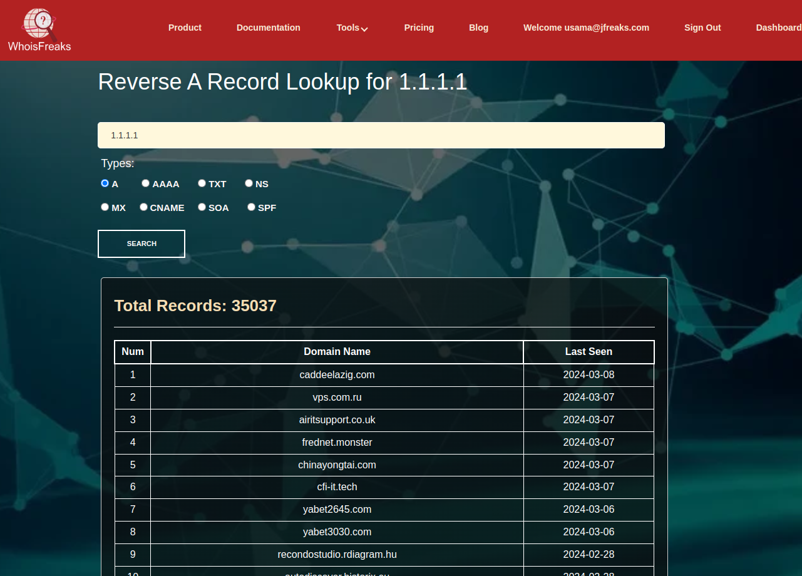

### AAAA Record

The AAAA record specifically handles the mapping of domain names to IPv6 addresses. IPv6 is the next-generation Internet Protocol that uses a 128-bit address scheme, providing a vastly larger address space compared to the 32-bit IPv4 addresses.

#### Tracking IPv6 Readiness Among Online Businesses

To gauge the adoption rate of IPv6 among online businesses in a specific sector, you decide to extract a list of domains with AAAA records. This can reveal which companies are ahead in adopting IPv6, ensuring future compatibility with the evolving internet infrastructure.

The information below pertains to a single IPv6 address. You can conduct a reverse search on the entire IPv6 range to retrieve all domain names that have already adopted IPv6. Alternatively, if you prefer to avoid iterative searches, we can provide you with a comprehensive database for the aforementioned use case.

**Here's a fact:** 177,348,276  domains currently support the IPv6 protocol.

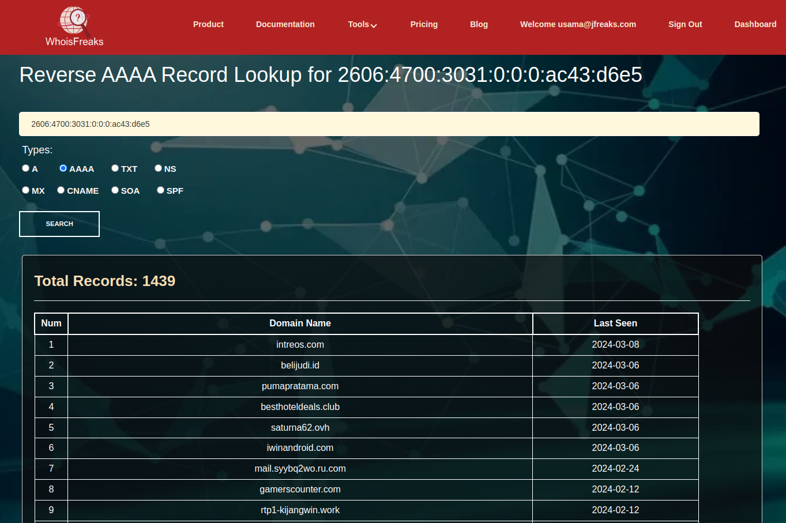

### CNAME Record

A CNAME (Canonical Name) record is a type of DNS (Domain Name System) resource record used to alias one domain name to another. It is often used to create a nickname or alias for a domain. The primary purpose of a CNAME record is to resolve one domain to another, allowing a more user-friendly and easily manageable domain name to point to the actual canonical (official) domain.

#### Mapping Domain Associations with CDN Providers

For performance analysis, you're interested in understanding how many domains leverage CDN services to enhance their site speed. By filtering for CNAME records pointing to known CDN provider domains like Akamai or Cloudflare, you can identify websites prioritizing performance and possibly using additional security features provided by CDNs.

**Here's a fact:** 7,18,536  domains currently uses cloudflare.

### ADD IMAGE

### MX Record

MX (Mail Exchange) records are a type of DNS (Domain Name System) resource record used to specify the mail servers responsible for receiving email messages on behalf of a domain. MX records play a crucial role in the email delivery process by directing messages to the appropriate mail servers designated for a particular domain.

#### Detecting Zoho Mail Adoption in Startups

To understand the popularity of Zoho Mail among startups, you search for MX records pointing to Zoho's mail servers. This helps map the usage pattern of Zoho Mail in the startup ecosystem.

**Here's a fact:** 47,81,790  domains currently uses zoho as their mail service provider.

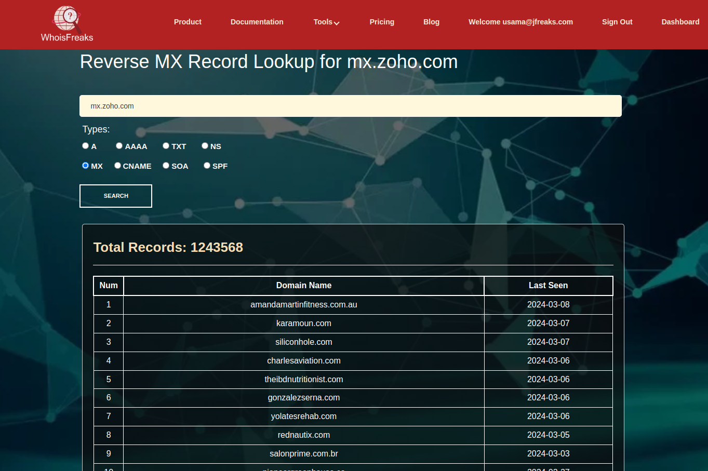 

#### Identifying Use of Disposable Email Services

Investigating the prevalence of disposable email services by identifying domains with MX records pointing to known temporary mail providers like "10minutesmail". This could be crucial for filtering out potential spam or fraudulent activities.

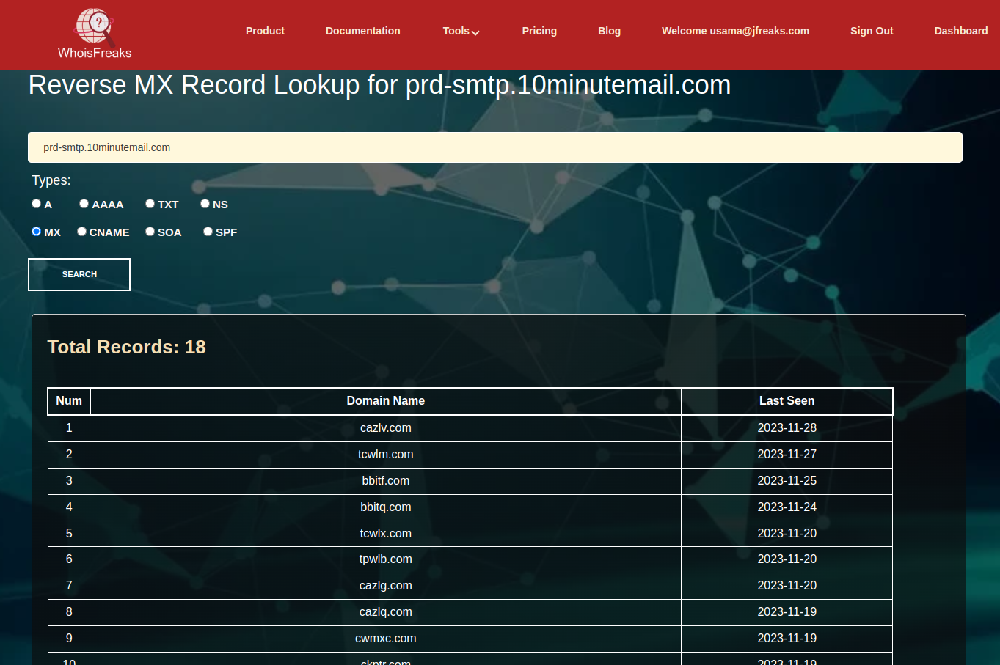

### NS Record

NS (Name Server) records are a type of DNS (Domain Name System) resource record that is used to delegate authority over a domain's DNS settings to a specific set of name servers. These records indicate which name servers are authoritative for a particular domain, providing the necessary information for resolving domain names to IP addresses.

#### Assessing Cloudflare's Dominance in DNS Hosting

To assess Cloudflare's market penetration as a DNS provider, you look for domains with NS records pointing to Cloudflare's name servers. This can give insights into Cloudflare's popularity and reliability as a DNS hosting service.

**Here's a fact:** Currently, 5,98,12,307 domains use Cloudflare as their hosting service provider.

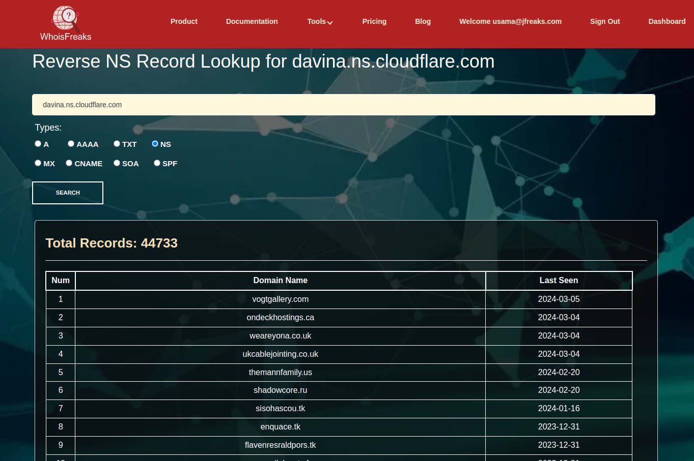

### SPF (and TXT) Record

SPF (Sender Policy Framework) and TXT (Text) records are types of DNS (Domain Name System) resource records used to provide information about a domain's email authentication policies. Both records are commonly used to help prevent email spoofing and phishing attacks by specifying which mail servers are authorized to send emails on behalf of a domain.

#### Auditing Domains for Email Spoofing Protection

To enhance email security awareness, you plan to audit domains within your organization for the presence of SPF records. By checking TXT records for SPF configurations, you can identify which domains are properly configured to prevent email spoofing and which are lacking, requiring further security measures.

**Here are facts:**
- 37,93,931 domains uses soft fail policy (~all) in their spf records.
- 3,46,122 domains uses hard fail (-all) in their spf records.
- 44,355 domains uses neutral (?all) in their spf records.
